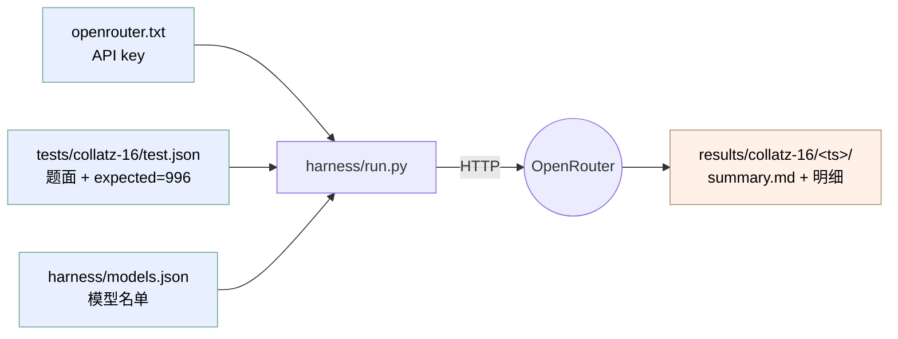
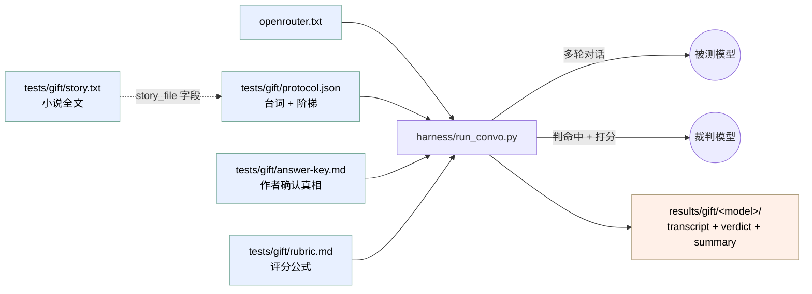

# IDIOT · 数据依赖图

IDIOT 是自包含的：运行时只依赖 OpenRouter API + Python 3 标准库。下面把"谁读谁、谁写谁"画清楚。

## Collatz-16（单轮，客观判分）

## Gift（《礼物》多轮 + 内置 API 裁判）

注意 Gift 比 Collatz **多一个运行时依赖：裁判模型**。结果质量直接受 `--judge` 选谁影响，别让模型当自己的裁判（同源偏差）。

## 进 git vs 不进 git

| | 文件 | 说明 |
|---|---|---|
| **进版本库** | `tests/` · `harness/` · `docs/` · `findings/` · `examples/` · `README*.md` · `.gitignore` · `openrouter.txt.example` | 真正的代码 + 数据 + 文档 |
| **被 .gitignore 排除** | `openrouter.txt`（密钥）· `results/`（跑出来的）· `__pycache__/` | 删了也无所谓，跑一遍就回来 |

## 几条易踩的死规则

1. **脚本必须留在仓库里跑。** 它们用 `__file__` 反推仓库根，单独拷走会找不到 `tests/` 和 key。
2. **Key 查找顺序**：环境变量 `OPENROUTER_API_KEY` → 仓库根 `openrouter.txt` → `harness/openrouter.txt`。
3. **零 pip 依赖**：只用 Python 3 标准库（urllib/json/argparse/threading）。不需要 `requirements.txt`。
4. **`findings/` 里的具体数字表是我们私有跑批的产物，未随仓库发布**——网友能复现的是**流程**，不是那些具体数字。
5. **`run.py` 读 `models.json`**（批量）；**`run_convo.py` 不读**——它直接吃 `--model` 和 `--judge`，每次只跑一个被测模型。
